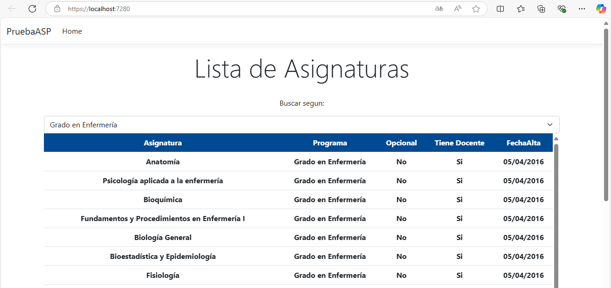

# PruebaASP
Página en .NET con MVC que muestre una tabla con las asignaturas obtenidas con Dapper.

#### Consulta Sql
consulta SQL que extraiga las asignaturas del Grado de Enfermería.
```bash
Select A.Asignatura, P.Programa, PA.EsOpcional, PA.TieneDocencia, PA.FechaAlta
  from [dbo].[TProgramasAsignaturas] PA 
  inner join [dbo].[TProgramas] P on PA.IdPrograma = P.IdPrograma 
  inner join [dbo].[TAsignaturas] A on PA.IdAsignatura = A.IdAsignatura 
  where PA.IdPrograma = 1;
```

#### Desarrollo en .NET con MVC:
<p align="start">
  
</p>

##### ¿Cómo optimizarías la pantalla para que sea lo más rápida posible, considerando que puede ser utilizada por muchos usuarios a la vez?
- Con Consultas asíncronas.
- Retornar los datos que sean necesarios.
- Uso del lazy loading en el frontend
